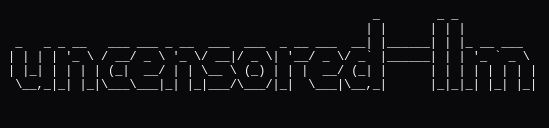

# uncensored-llm

Run uncensored LLMs locally with Ollama.



## How it works

1. On startup, checks if the `ollama` Python client can reach a local Ollama instance; if not, prompts to open the download page
2. Loads model metadata from `models.json` and user preferences (last model, response color) from `config.json`
3. Runs a REPL loop: `/` prefixed input is parsed as a command (switch, install, colors, etc.), anything else is sent as a chat message
4. Chat messages are streamed via `ollama.chat(..., stream=True)`, printing each token as it arrives instead of waiting for the full response
5. Any state changes (model switch, color change) are persisted back to `config.json` immediately

## Advantages

* Full privacy, nothing leaves your machine, good for sensitive code/data
* No API costs, no rate limits
* Works offline
* No usage tracking or logging by a third party
* You control the model version indefinitely (no silent updates/deprecation)
* Good for repetitive/high-volume tasks where cloud costs add up

## Disadvantages

* Weaker reasoning and code quality, especially on complex or multi-step tasks
* Requires local hardware/GPU
* Smaller context windows
* No automatic updates to better models
* No web search, file handling, and other integrated tools
* Better for tasks prioritizing speed over accuracy

## Installation

Requirements: [`uv`](https://docs.astral.sh/uv/)

```bash
uv tool install git+https://github.com/p4p2r0/uncensored-llm
```

```bash
uncensored-llm
```

## Disclaimer

You are responsible for any output generated.

## License

This project is licensed under the [MIT License](LICENSE).