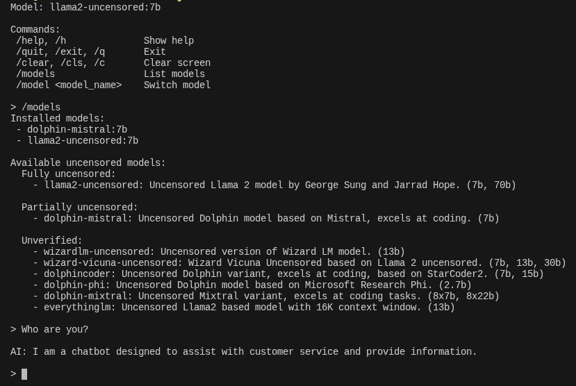

# uncensored-llm

Run uncensored LLMs locally with Ollama.



## How it works

1. Check if Ollama is installed (prompt to download if not)
2. List installed and available uncensored models
3. Switch between models
4. Chat with selected model
5. Save last used model for next session

## Advantages

* Full privacy, nothing leaves your machine, good for sensitive code/data
* No API costs, no rate limits
* Works offline
* No usage tracking or logging by a third party
* You control the model version indefinitely (no silent updates/deprecation)
* Good for repetitive/high-volume tasks where cloud costs add up

## Disadvantages

* Weaker reasoning and code quality, especially on complex or multi-step tasks
* Requires local hardware/GPU
* Smaller context windows
* No automatic updates to better models
* No web search, file handling, and other integrated tools
* Better for tasks prioritizing speed over accuracy

## Installation

Requirements: [`uv`](https://docs.astral.sh/uv/)

```bash
uv tool install git+https://github.com/p4p2r0/uncensored-llm
```

```bash
uncensored-llm
```

## Disclaimer

You are responsible for any output generated.

## License

This project is licensed under the [MIT License](LICENSE).
